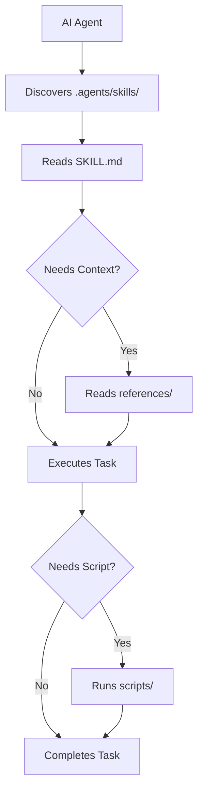

# `.agents/` — Vendor-Neutral Skill Library

This directory provides a **vendor-neutral skill library** following the [`.agents/` convention](https://github.com/anthropics/agent-skills-spec). Skills defined here work with **any AI coding tool** — Claude Code, GitHub Copilot, OpenAI Codex, Google Gemini CLI, and others.

## Project Context

**Loomind Studio** is a polyglot monorepo (Python + TypeScript + Rust) for the AI Experience Engine — a system that intercepts AI agent actions and provides context-aware suggestions from team knowledge.

## Directory Structure

```
.agents/
└── skills/
    ├── generate-reports/
    │   ├── SKILL.md
    │   ├── references/
    │   └── scripts/
    ├── health-check/
    │   ├── SKILL.md
    │   ├── references/
    │   └── scripts/
    ├── run-tests/
    │   ├── SKILL.md
    │   ├── references/
    │   └── scripts/
    └── security-review/
        ├── SKILL.md
        ├── references/
        └── scripts/
```

## Available Skills

| Skill | Directory | Description |
|-------|-----------|-------------|
| **Generate Reports** | `generate-reports/` | Generate engine statistics, API performance analytics, and health reports |
| **Health Check** | `health-check/` | Run Experience Engine health checks — verify Qdrant, Embedder, and API status |
| **Run Tests** | `run-tests/` | Execute the Python test suite and TypeScript build verification |
| **Security Review** | `security-review/` | Review code for security vulnerabilities, hardcoded secrets, injection risks |

## How It Works



## Skill Anatomy

Every skill follows a three-part structure:

| Component | Purpose | Format |
|-----------|---------|--------|
| `SKILL.md` | Entry point — describes the skill and step-by-step instructions | Markdown with YAML frontmatter |
| `references/` | Supporting knowledge documents for context | Markdown files |
| `scripts/` | Executable helpers the agent can run | Python, Bash |

## Skill Discovery

1. **Scan** — Agent checks for `.agents/skills/` in the project root
2. **Enumerate** — Each subdirectory is a skill
3. **Read** — Agent reads `SKILL.md` for instructions
4. **Load Context** — Agent reads `references/` for deeper knowledge
5. **Execute** — Agent runs `scripts/` if automation is needed

## Related Files

| Path | Purpose |
|------|---------|
| `.claude/` | Claude Code configuration (agents, rules, skills) |
| `.codex/` | OpenAI Codex configuration |
| `docs/ai-assistant-instructions.md` | Full AI agent API integration guide |
