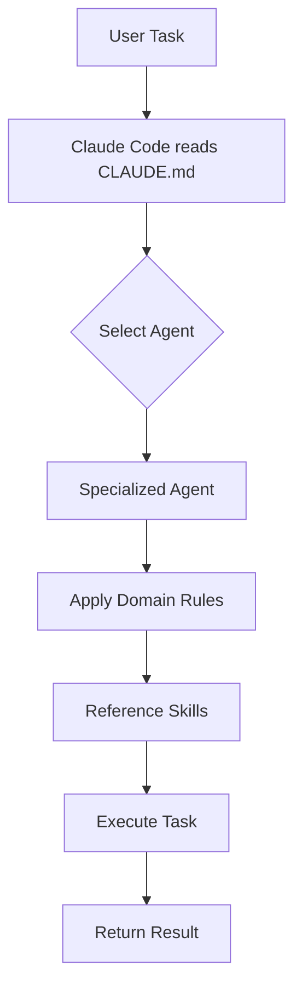

# `.claude/` — Claude Code Configuration

This directory configures [Claude Code](https://docs.anthropic.com/en/docs/claude-code) for the **Loomind Studio** project — a polyglot monorepo (Python + TypeScript + Rust) for the AI Experience Engine.

## Directory Structure

```
.claude/
├── CLAUDE.md              — Entry-point instructions for Claude Code
├── settings.json          — Project-level permissions
├── agents/                — 11 specialized sub-agents
├── rules/                 — 11 domain-specific rules
└── skills/                — 22+ reusable skill templates (6+ categories)
```

## How It Works

**`CLAUDE.md`** is the entry point Claude Code reads when it opens this project. It defines:
- Build, test, and dev commands for the polyglot monorepo
- Architecture overview (Python FastAPI engine + TypeScript SDK + Tauri desktop)
- Key file locations and API endpoints
- Code style rules and conventions



## Agents

Specialized sub-agents handle domain-specific tasks. Each agent is a Markdown file in `agents/`.

| Agent | File | Domain |
|-------|------|--------|
| AI/ML Engineer | `ai-ml-engineer.md` | ML pipelines, embeddings, LLM integration |
| Backend API | `backend-api.md` | REST APIs, FastAPI, databases |
| Code Reviewer | `code-reviewer.md` | Code review, best practices |
| Database Architect | `database-architect.md` | Schema design, query optimization |
| DevOps Infrastructure | `devops-infrastructure.md` | Docker, CI/CD, deployment |
| Documentation Writer | `documentation-writer.md` | API docs, architecture docs |
| Mobile Developer | `mobile-developer.md` | Cross-platform mobile |
| Performance Engineer | `performance-engineer.md` | Profiling, optimization |
| Security Specialist | `security-specialist.md` | OWASP, vulnerability analysis |
| Test Runner | `test-runner.md` | Test execution, failure diagnosis |
| Web Frontend | `web-frontend.md` | React, Tauri, accessibility |

### Invoking Agents

```
@web-frontend Review this React component
@security-specialist Audit this endpoint
@backend-api Design a new API route
```

## Rules

Domain-specific rules in `rules/` enforce coding standards. Claude automatically applies relevant rules.

| Rule | File | Enforces |
|------|------|----------|
| AI/ML | `ai-ml.md` | Embedding practices, model versioning |
| Adapters | `adapters.md` | Adapter pattern conventions |
| API Design | `api-design.md` | REST conventions, endpoint patterns |
| CI/CD | `ci-cd.md` | Pipeline configuration |
| Config | `config.md` | Configuration management |
| Database | `database.md` | Query safety, migration patterns |
| Frontend | `frontend.md` | Component structure, accessibility |
| Observability | `observability.md` | Logging, metrics, health checks |
| Performance | `performance.md` | Optimization guidelines |
| Security | `security.md` | Input validation, auth patterns |
| Testing | `testing.md` | Test structure, fixtures |

## Skills

Reusable skill templates in `skills/` provide patterns and best practices, organized by category.

| Category | Skills | Description |
|----------|--------|-------------|
| `development/` | 6 skills | React, REST API, Python async, DB queries, GraphQL, error handling |
| `security/` | 4 skills | Authentication, input validation, secure coding, vulnerability assessment |
| `testing/` | 4 skills | Unit testing, integration testing, TDD, performance testing |
| `ai-ml/` | 3 skills | Embeddings & retrieval, LLM integration, RAG pipelines |
| `devops/` | 3 skills | Docker, CI/CD pipelines, Kubernetes |
| `documentation/` | 3 skills | API docs, architecture docs, code documentation |
| `generate-reports/` | 1 skill | Generate engine performance reports |
| `health-check/` | 1 skill | Run engine health checks |
| `run-tests/` | 1 skill | Execute test suite |

## Related Files

| File | Purpose |
|------|---------|
| `.agents/skills/` | Vendor-neutral skill library (works with any AI coding tool) |
| `.codex/` | OpenAI Codex-specific agent configurations |
| `docs/ai-assistant-instructions.md` | Full API integration guide for AI agents |
