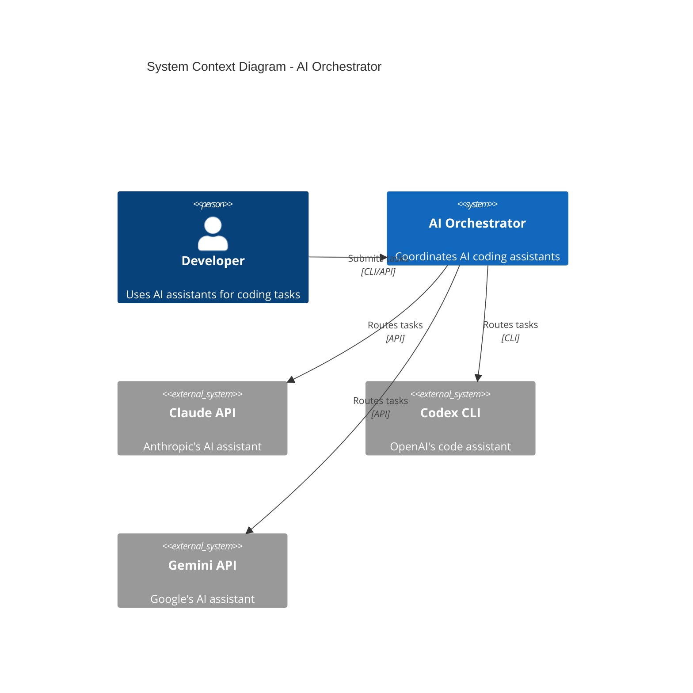
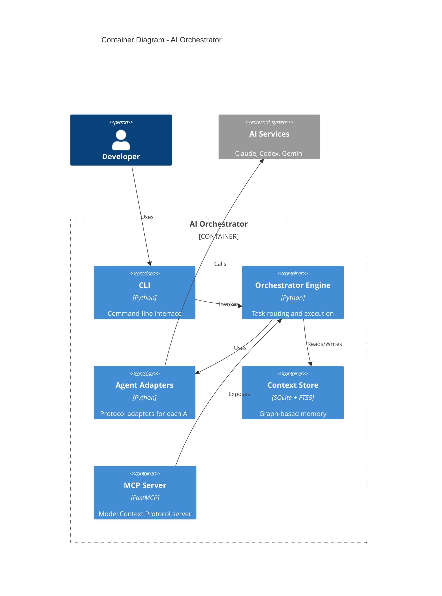
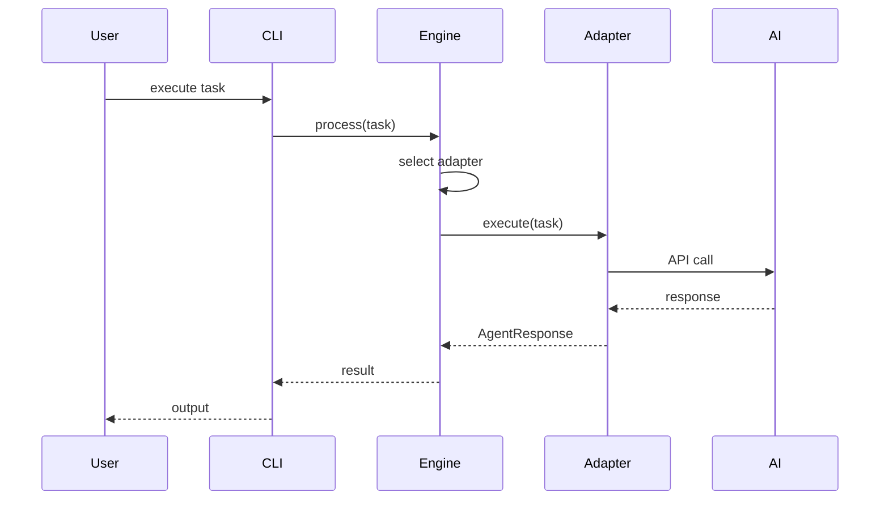

# Skill: Architecture Documentation

Document system architecture with diagrams, decisions, and design rationale.

## Capabilities
- C4 model diagrams
- Architecture Decision Records (ADRs)
- Component documentation
- Data flow diagrams
- Sequence diagrams
- Mermaid diagram syntax

## Patterns

### C4 Model - Context Diagram (Mermaid)


### C4 Model - Container Diagram


### Architecture Decision Record (ADR)
```markdown
# ADR-001: Use SQLite for Graph Context Storage

## Status
Accepted

## Context
We need persistent storage for the graph-based context system that stores
conversations, tasks, mistakes, and patterns. The storage must support:
- Full-text search
- JSON column storage
- Graph traversal queries
- Single-file deployment

## Decision
We will use SQLite with FTS5 extension for the context storage.

## Consequences

### Positive
- Single file deployment (no external database)
- FTS5 provides fast full-text search
- JSON1 extension for flexible metadata
- ACID compliant
- No additional infrastructure

### Negative
- Limited concurrent write performance
- No built-in vector search (requires custom implementation)
- Graph queries less efficient than dedicated graph DB

### Neutral
- Requires thread-local connections for multi-threading
- Migration management needed

## Alternatives Considered

### PostgreSQL
- Pros: Better concurrency, pg_vector extension
- Cons: External service, operational overhead

### Neo4j
- Pros: Native graph database, Cypher queries
- Cons: Heavy infrastructure, licensing concerns

### ChromaDB
- Pros: Built-in embeddings, simple API
- Cons: Less flexible schema, newer/less stable
```

### Component Documentation
```markdown
# Context System Architecture

## Overview
The context system provides persistent memory for AI agents, enabling them to
learn from past interactions and avoid repeating mistakes.

## Components

### GraphStore (`graph_store.py`)
SQLite-backed graph database with FTS5 full-text search.

**Responsibilities:**
- Node and edge CRUD operations
- Full-text search indexing
- Embedding storage

**Key Methods:**
- `add_node(node)` - Add a node to the graph
- `add_edge(source, target, type)` - Create relationship
- `full_text_search(query)` - Search node content

### MemoryManager (`memory_manager.py`)
High-level API for context operations.

**Responsibilities:**
- Store conversations, tasks, mistakes
- Search and retrieval
- Context assembly for prompts

## Data Flow

```
User Query
    │
    ▼
┌─────────────────┐
│ Memory Manager  │
└────────┬────────┘
         │
    ┌────┴────┐
    ▼         ▼
┌───────┐ ┌──────────┐
│ BM25  │ │ Semantic │
│ Index │ │ Search   │
└───┬───┘ └────┬─────┘
    │          │
    └────┬─────┘
         ▼
┌─────────────────┐
│  Hybrid Search  │
│  (RRF Fusion)   │
└────────┬────────┘
         │
         ▼
    Ranked Results
```
```

### Sequence Diagram


## Checklist
- [ ] Context diagram shows system boundaries
- [ ] Container diagram shows major components
- [ ] ADRs document key decisions
- [ ] Data flows are diagrammed
- [ ] Component responsibilities clear
- [ ] Mermaid diagrams render correctly
- [ ] Diagrams versioned with code
