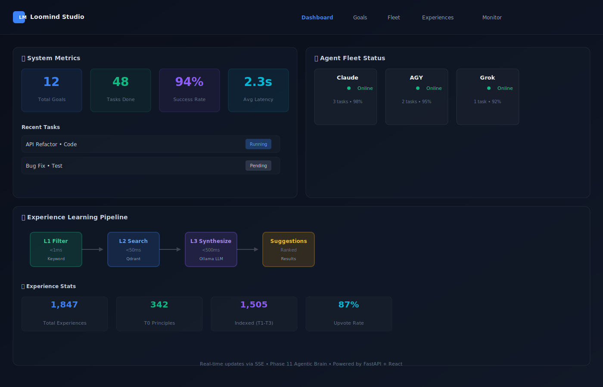

<div align="center">

# Loomind Studio

### AI Experience Engine — Polyglot Monorepo

**An autonomous multi-agent platform that intercepts AI coding actions, orchestrates goal-driven work across a fleet of CLIs, and learns from every session.**

[](https://python.org)
[](https://typescriptlang.org)
[](https://rust-lang.org)
[](https://fastapi.tiangolo.com)
[](https://react.dev)
[](https://tauri.app)
[](LICENSE)

[Architecture](#architecture) · [Quick Start](#quick-start) · [Daily Workflow](#daily-workflow) · [CLI Setup](#cli-setup) · [Deploy](#deploy) · [API](#api-reference)

</div>

---

## Dashboard Overview

Loomind Studio comes with a modern, real-time React dashboard for managing the entire system:

| Page | Purpose |
|------|---------|
| **Dashboard** | Real-time system metrics, task queue, SSE event stream visualization |
| **Goals** | Submit goals (Quick Submit or BA Analyze), track goal lifecycle, view all active/completed goals |
| **Fleet** | Monitor CLI agent status (online/busy/idle), per-agent task counts, real-time heartbeat |
| **Experiences** | Browse, search, filter knowledge base; upvote/downvote experiences; export/import backups |
| **Agents** | View registered agents, task affinity, success/failure stats, role-based assignments |
| **Monitor** | System health, engine stats, database metrics, SSE event count, vector store status |
| **Graph** | Visualize goal → task → result DAG, experience evolution timeline, inter-agent dependencies |
| **Terminal** | Web-based terminal with fleet shell access, run CLI commands remotely (optional) |
| **Settings** | Configure notification webhooks (Telegram, Discord), feature flags, experience promotion/demotion rules |

**Open the live dashboard:** `http://localhost:5173` (running `npm run dev`)

---

## What Is This?

Loomind Studio is an **AI Experience Engine** — a self-learning orchestration platform that:

1. **Intercepts** AI agent actions before they execute (L1 filter → L2 semantic search → L3 LLM)
2. **Orchestrates** autonomous goal execution across a fleet of CLI agents (Claude, Grok, AGY, Codex)
3. **Learns** from every session — experiences are promoted/demoted based on real usage outcomes
4. **Coordinates** multi-agent deliberation with Human-in-the-Loop approval gates

> **Think of it as the "brain" behind your AI coding fleet.** Goals flow in, tasks flow out, CLIs execute them autonomously, and the system gets smarter over time.



---

## Architecture

```
┌─────────────────────────────────────────────────────────────────────┐
│                        Loomind Studio                           │
│                                                                     │
│  ┌───────────────────────────────────────────────────────────────┐  │
│  │                    Docker (port 8082)                         │  │
│  │                                                               │  │
│  │   POST /api/intercept                                         │  │
│  │   ┌──────────┐    ┌──────────────┐    ┌──────────────────┐   │  │
│  │   │ L1 Filter│───▶│ L2 Semantic  │───▶│  L3 LLM Rerank   │   │  │
│  │   │ <1ms     │    │ Qdrant :6333 │    │  Ollama :11434   │   │  │
│  │   └──────────┘    └──────────────┘    └──────────────────┘   │  │
│  │                                                               │  │
│  │   Agentic Brain (Phase 11)                                    │  │
│  │   ┌──────────────────────────────────────────────────────┐   │  │
│  │   │ Goal ──▶ BA Agent ──▶ Tasks ──▶ SSE ──▶ CLI Fleet   │   │  │
│  │   │         decompose     queue     push     claim/exec  │   │  │
│  │   └──────────────────────────────────────────────────────┘   │  │
│  │                                                               │  │
│  │   HITL Gate: SECURITY tasks always require manual approval    │  │
│  └───────────────────────────────────────────────────────────────┘  │
│                              │ API                                  │
│          ┌───────────────────┼──────────────────────┐              │
│          │                   │                      │              │
│  ┌───────▼──────┐  ┌─────────▼────────┐  ┌─────────▼──────────┐  │
│  │  Dashboard   │  │   CLI Bridge     │  │    Agent Loop      │  │
│  │  React+Tauri │  │   :8083 (host)   │  │    agent_loop.py   │  │
│  │  :5173       │  │   subprocess     │  │    poll every 15s  │  │
│  └──────────────┘  └──────────────────┘  └────────────────────┘  │
│                                │                                    │
│            ┌───────────────────┼────────────────────┐              │
│            │                   │                    │              │
│     ┌──────▼──┐         ┌──────▼──┐         ┌──────▼──┐           │
│     │ Claude  │         │   AGY   │         │  Grok   │           │
│     │ :coding │         │ :eval   │         │:research│           │
│     └─────────┘         └─────────┘         └─────────┘           │
└─────────────────────────────────────────────────────────────────────┘
```

### Repository Layout

```
loomind-studio/
├── core/loomind-engine/     # Python — FastAPI engine (3-layer pipeline + Agentic Brain)
│   ├── src/domain/              # Business logic: ExperienceService, GoalService, BAAgent
│   ├── src/infrastructure/      # Qdrant, Embedder, LLM, EventBus
│   └── src/presentation/        # FastAPI routers: intercept, goals, agents, stream, ba
├── apps/
│   ├── loomind-desktop/     # React 19 + Tauri 2 — Dashboard UI (9 pages)
│   ├── loomind-cli/         # TypeScript CLI — status, list, add, search, export
│   ├── cli-bridge/              # Python — host-side subprocess proxy for CLI fleet
│   └── docker-deployment/       # Docker Compose: Engine + Qdrant
├── packages/
│   ├── loomind-types/       # Shared TypeScript types
│   └── loomind-client/      # TypeScript SDK + offline queue + L1 filter
├── extensions/vscode/           # VS Code Extension — Copilot hooks
├── scripts/
│   ├── deploy/                  # deploy-docker.ps1, update-engine.ps1
│   ├── fleet-hooks/             # tsx-agy.ps1, tsx-codex.ps1, SETUP.md
│   └── cli-setup.ps1            # One-shot CLI fleet setup
├── start.ps1                    # Full stack launcher (PowerShell)
├── start.bat                    # Full stack launcher (CMD)
├── stop.ps1                     # Stop background services
└── start.sh                     # Full stack launcher (Bash/WSL)
```

---

## Quick Start

### Prerequisites

| Tool | Version | Download |
|------|---------|----------|
| Docker Desktop | latest | [docker.com](https://docker.com) |
| Node.js | 20+ | [nodejs.org](https://nodejs.org) |
| Python | 3.10+ | [python.org](https://python.org) |

### 1. Clone and install

```bash
git clone https://github.com/KhaiTrang1995/loomind-studio
cd loomind-studio
npm install
```

### 2. First-time CLI setup (Windows — run once)

```powershell
.\scripts\cli-setup.ps1
. $PROFILE          # reload PowerShell to activate wrappers
```

This auto-detects Claude, AGY, Grok, Codex paths and configures fleet hooks.

### 3. Start everything

```powershell
.\start.ps1         # PowerShell
# or
start.bat           # CMD / double-click
# or
bash start.sh       # Bash / WSL
```

Services started:

| Service | URL | Description |
|---------|-----|-------------|
| Engine API | http://localhost:8082 | FastAPI — main orchestration brain |
| Engine Docs | http://localhost:8082/docs | Interactive Swagger UI |
| Qdrant | http://localhost:6333 | Vector database |
| CLI Bridge | http://localhost:8083 | Host-side CLI subprocess proxy |
| Dashboard | http://localhost:5173 | React management UI |

### 4. Open Dashboard

```
http://localhost:5173
```

Pages: **Dashboard** · **Goals** · **Fleet** · **Experiences** · **Agents** · **Monitor** · **Graph** · **Terminal** · **Settings**

---

## Features in Action

### Submit & Track Goals
1. Open **Goals** page → click **"Submit Goal"**
2. Enter goal: *"Add dark mode toggle to the dashboard"*
3. Click **"BA Analyze"** → BA Agent decomposes into 4 tasks with Fibonacci story points
4. Watch real-time status: Research → Code → Test → Evaluate
5. See HITL dialog appear for SECURITY tasks (180s countdown to auto-execute)

### Monitor Fleet in Real-Time
1. Open **Fleet** page
2. See online agents (Claude, AGY, Grok, Codex) with task counts and affinity scores
3. Click an agent → see its task history, success rate, estimated latency
4. Switch to **Monitor** → visualize live SSE events (task_assigned, goal_completed, experience_evolved)

### Learn from Experiences
1. Open **Experiences** → search for similar patterns
2. L1 filter (keyword), L2 semantic search (Qdrant), L3 LLM synthesis all show up
3. Upvote successful experiences → they're promoted toward T0 (principles)
4. Downvote failed experiences → they're demoted (feedback loop closes)
5. Export **backup** (full knowledge base) — share across teams or snapshot before major changes

### Graph View (Advanced)
1. Open **Graph** → see goal decomposition DAG
2. Nodes = tasks, edges = dependencies
3. Color codes: pending (gray), in_progress (blue), completed (green), failed (red)
4. Hover over nodes → see task output, prior context, CLI stdout
5. Right-click → "View in Terminal" to debug a specific task execution

---

## Daily Workflow

```
Every session:
──────────────────────────────────────────────────────────────────
1.  .\start.ps1                   # starts engine + bridge + loop + UI

2.  Open http://localhost:5173/goals
    → Submit a goal (Quick Submit or BA Analyze)

3.  Watch http://localhost:5173/fleet
    → See which CLI picked up which task
    → Approve HITL tasks when prompted

4.  When done:  .\stop.ps1        # stops bridge + loop + UI
                                  # Docker keeps running
──────────────────────────────────────────────────────────────────
```

### Using CLIs manually alongside the fleet

| CLI | How to run | Fleet tracking |
|-----|-----------|----------------|
| Claude | `claude` (native hooks in settings.json) | Automatic via hooks |
| AGY | `agy` (uses wrapper from cli-setup) | Automatic via wrapper |
| Codex | `codex` (uses wrapper from cli-setup) | Automatic via wrapper |
| Grok | `grok` | Manual hook in ~/.grok/config.toml |

All CLIs report `busy/idle` status to Fleet Monitor in real-time.

---

## CLI Setup

> Run `.\scripts\cli-setup.ps1` to automate all of this.

### Claude (native hooks)

Add to `~/.claude/settings.json`:
```json
{
  "hooks": {
    "UserPromptSubmit": [{"matcher":"","hooks":[{"type":"command",
      "command":"curl -sf -X PATCH \"http://localhost:8082/api/agents/claude/status\" -H \"Content-Type: application/json\" -d \"{\\\"status\\\":\\\"busy\\\"}\" >nul 2>&1 || exit 0"}]}],
    "Stop": [{"matcher":"","hooks":[{"type":"command",
      "command":"curl -sf -X PATCH \"http://localhost:8082/api/agents/claude/status\" -H \"Content-Type: application/json\" -d \"{\\\"status\\\":\\\"idle\\\"}\" >nul 2>&1 || exit 0"}]}]
  }
}
```

### AGY / Codex (PowerShell wrappers)

Add to PowerShell profile (`notepad $PROFILE`):
```powershell
function agy   { & "D:\GitHub\loomind-studio\scripts\fleet-hooks\tsx-agy.ps1"   @args }
function codex { & "D:\GitHub\loomind-studio\scripts\fleet-hooks\tsx-codex.ps1" @args }
```

### Grok (config.toml hooks)

Add to `~/.grok/config.toml`:
```toml
[[hooks.UserPromptSubmit]]
command = 'curl -sf -X PATCH "http://localhost:8082/api/agents/grok/status" -H "Content-Type: application/json" -d "{\"status\":\"busy\"}" >nul 2>&1 || exit 0'

[[hooks.Stop]]
command = 'curl -sf -X PATCH "http://localhost:8082/api/agents/grok/status" -H "Content-Type: application/json" -d "{\"status\":\"idle\"}" >nul 2>&1 || exit 0'
```

---

## Deploy

### Deploy / redeploy Docker engine

```powershell
# Initial deploy or after Dockerfile/dependency changes
.\scripts\deploy\deploy-docker.ps1

# Deploy + pull latest git changes first
.\scripts\deploy\deploy-docker.ps1 -Pull

# Force rebuild (no cache)
.\scripts\deploy\deploy-docker.ps1 -Pull -Force
```

### Hot-patch engine code (seconds, not minutes)

```powershell
# Copy src/ changes into running container + graceful reload
.\scripts\deploy\update-engine.ps1

# Full container restart (preserves volumes)
.\scripts\deploy\update-engine.ps1 -Restart
```

### Manual Docker commands

```bash
# Start
cd apps/docker-deployment && docker compose up -d

# Stop (keep data)
docker compose stop

# Destroy + clean data
docker compose down -v

# Logs
docker logs -f loomind-engine

# Shell into container
docker exec -it loomind-engine bash
```

---

## API Reference

Base URL: `http://localhost:8082`

### Core Pipeline

| Method | Endpoint | Description |
|--------|----------|-------------|
| `POST` | `/api/intercept` | Main intercept — 3-layer pipeline, returns suggestions |
| `POST` | `/api/posttool` | Report what you did with suggestions (closes learning loop) |

### Experiences (Knowledge Base)

| Method | Endpoint | Description |
|--------|----------|-------------|
| `GET` | `/api/experiences` | List experiences (paginated) |
| `POST` | `/api/experiences` | Add experience |
| `POST` | `/api/experiences/search` | Semantic search |
| `POST` | `/api/experiences/{id}/feedback` | Upvote / downvote |
| `GET` | `/api/experiences/backup/export` | Export full backup |
| `POST` | `/api/experiences/backup/import` | Restore from backup |

### Goals & Orchestration

| Method | Endpoint | Description |
|--------|----------|-------------|
| `POST` | `/api/goals` | Submit goal (auto-decomposes into 4 tasks) |
| `GET` | `/api/goals` | List all goals |
| `GET` | `/api/goals/{id}` | Get goal detail |
| `POST` | `/api/ba/analyze` | BA Agent — LLM decomposition with story points |
| `POST` | `/api/ba/goals/{id}/tasks/{tid}/approve` | HITL approve/reject |

### Agent Fleet

| Method | Endpoint | Description |
|--------|----------|-------------|
| `GET` | `/api/agents/fleet` | List CLIs with task counts |
| `PATCH` | `/api/agents/{id}/status` | Update CLI status (online/busy/idle/offline) |
| `GET` | `/api/stream/fleet` | SSE stream — live fleet status |
| `GET` | `/api/stream/{agent_id}` | SSE stream — per-agent events |

### System

| Method | Endpoint | Description |
|--------|----------|-------------|
| `GET` | `/health` | Liveness probe |
| `GET` | `/ready` | Readiness probe |
| `GET` | `/api/stats` | Engine statistics |

---

## Features

### 3-Layer Intercept Pipeline

| Layer | Name | Function | Latency |
|-------|------|----------|---------|
| **L1** | Read-only Filter | Skip non-destructive actions | **< 1ms** |
| **L2** | Semantic Search | Embed → vector search in Qdrant | **< 50ms** |
| **L3** | LLM Rerank | Ollama filters irrelevant results | **< 500ms** |

### Agentic Brain (Phase 11)

| Feature | Detail |
|---------|--------|
| **BA Agent** | LLM-powered goal decomposition into User Stories + Fibonacci story points |
| **Goal Pipeline** | Research → Code → Test → Evaluate — 4 tasks, 4 CLIs |
| **HITL Gates** | SECURITY tasks never auto-approve; 180s timeout for others |
| **Priority Queue** | SQLite-backed WAL mode; tasks survive restarts |
| **Fleet SSE** | Real-time push to Dashboard: task claimed, task done, HITL triggered |
| **Deliberation** | Multi-CLI structured debate with consensus + HITL escalation |
| **MCP Tools** | 15 tools: intercept, experiences, goals, tasks, agents, deliberation |

---

## Security Rules

- **SECURITY tasks**: HITL mandatory, never auto-escalate regardless of timeout
- **DELETE operations**: HITL mandatory
- **Never commit `.env`** — copy `.env.example` and fill in secrets
- **No auto-delete** of experiences or goals without explicit user action
- Engine secrets via `apps/docker-deployment/.env` (not committed)

---

## Agent Loop — Architecture Analysis

This section documents how the task-execution pipeline currently works, where the design has known gaps, and what improvements would address them.

### How It Works Today

```
Goal submitted
  └─▶ BA Agent (LLM) → GoalRecord + TaskRecord[]
        └─▶ Sequential pipeline: research → code → test → evaluate
              └─▶ agent_loop.py polls every 15s per CLI
                    └─▶ claim_task (atomic SQLite lock)
                          └─▶ CLI via bridge (subprocess cwd=worktree_path)
                                └─▶ parse output → complete_task
                                      └─▶ evaluate NEEDS_REVISION? → spawn revision cycle (max 3)
                                            └─▶ _finish_goal → SSE broadcast
```

Key invariants enforced today:
- **Strict sequential order** — `_prerequisites_done()` blocks `code` until `research` is complete, `test` until `code` is complete, etc. No task of stage N+1 can start while any task of stage N is incomplete.
- **Atomic exclusive claim** — SQLite `UPDATE WHERE status=pending` prevents two CLIs from double-claiming the same task.
- **Retry with blacklist** — a CLI that fails a task 3× is added to `task.failed_by`; future claims from that agent are rejected.
- **HITL safety** — `SECURITY` tasks and DELETE operations require manual approval; HITL timeout (180s) never auto-escalates SECURITY tasks.
- **Revision loop** — evaluator signals `NEEDS_REVISION` → 3 new tasks (code + test + evaluate) spawned, up to `MAX_ITERATIONS = 3`.

---

### Known Limitations & Improvement Areas

#### 1. No parallel task execution — pipeline is always strictly serial

**Current:** `_next_pending()` walks `_ORDER = ["research", "code", "test", "evaluate"]` and returns the first pending task of the next eligible type. Tasks of the same type queue up behind each other.

**Problem:** A BA-decomposed goal might produce `code_frontend`, `code_backend`, and `code_db-schema` — three independent coding tasks. All three execute one after the other, wasting available agents.

**Improvement:** Replace the type-level ordering with an explicit **task dependency graph** (each `TaskRecord` declares `depends_on: list[task_id]`). The scheduler runs any task whose dependency set is fully `COMPLETED`, enabling parallel execution across independent branches.

```
Before (serial):              After (DAG):
research                      research
   └─▶ code_A                    ├─▶ code_frontend ──┐
         └─▶ code_B              ├─▶ code_backend  ──┼─▶ test_integration ──▶ evaluate
               └─▶ test          └─▶ code_db       ──┘
                     └─▶ eval
```

**Files:** `goal_service.py:_next_pending()`, `goal_service.py:_prerequisites_done()`, `models.py:TaskRecord`

---

#### 2. Context loss across task handoffs

**Current:** `get_prior_context()` in `agent_loop.py` fetches all completed tasks and truncates each outcome to 200 characters. A code task that produced 800 lines of implementation is summarized in one sentence for the test agent.

**Problems:**
- Evaluator and test agents work blind — they receive a summary, not the actual artifact.
- Revision cycles carry only 400 chars of evaluator feedback (`_spawn_revision_tasks`). The code agent in revision 2 doesn't know what the code in revision 1 looked like.
- No structured handoff schema — agents must parse free-form text to find filenames, decisions, blockers.

**Improvement:**
- Store full outputs in `artifacts["full_output"]` (not just `key_output[:500]`).
- Add a **structured handoff format** that agents write to and subsequent agents read from: `{ "files_created": [...], "decisions": [...], "blockers": [...], "summary": "..." }`.
- For revision cycles: pass a diff of what changed, not just the new feedback snippet.

**Files:** `agent_loop.py:get_prior_context()`, `goal_service.py:_spawn_revision_tasks()`, `agent_loop.py:TASK_PROMPT_TEMPLATE`

---

#### 3. Poll-only coordination — up to 15s lag before a task is picked up

**Current:** `cli_loop()` calls `get_available_tasks()` every `POLL_INTERVAL = 15s`. When a research task completes and unlocks a code task, the code agent won't see it for up to 15 seconds.

**The engine already has SSE push** (`EventBus.publish()` → `task_assigned` event), but `agent_loop.py` never subscribes to `/api/stream/{agent_id}`. The SSE infrastructure is wired but unused by the loop.

**Improvement:** Each CLI loop opens a persistent SSE connection to `/api/stream/cli-{name}`. On `task_assigned` event, immediately poll and attempt to claim — no waiting for the 15s tick. Keep the 15s poll as a heartbeat fallback only.

**Files:** `agent_loop.py:cli_loop()`, `agent_loop.py:main()`

---

#### 4. Stuck-task sweeper compares against `created_at` instead of `claimed_at`

**Current:** `_stuck_task_sweeper()` releases a task if `age > CLAIM_TIMEOUT_SECONDS (300s)` where `age` is computed from `task.created_at`. A task created 290 seconds ago and claimed 10 seconds ago gets released after 10 more seconds — well before the 5-minute window.

**Improvement:** Add `claimed_at: Optional[datetime]` to `TaskRecord`. The sweeper compares `now - claimed_at`, not `now - created_at`. Tasks that are pending (never claimed) are never swept — only CLAIMED/IN_PROGRESS ones.

**Files:** `goal_service.py:_stuck_task_sweeper()`, `models.py:TaskRecord`, `goal_store.py`

---

#### 5. Hard-coded 4 task types — not extensible without code changes

**Current:** The type system (`_ORDER`, `CLI_TASK_AFFINITY`, `_TASK_INSTRUCTIONS`, `_default_pipeline`) is a static dictionary keyed by 4 strings: `research | code | test | evaluate`. Adding `deploy`, `document`, `design`, `migrate`, or `debug` requires changes in at least 5 places.

**Improvement:** Move task type definitions into a config file or database table:
```json
{
  "task_types": {
    "deploy":   { "order": 5, "instructions": "...", "affinity": {"claude": 1, "agy": 2} },
    "document": { "order": 6, "instructions": "...", "affinity": {"grok": 1}              }
  }
}
```
`_TASK_INSTRUCTIONS` and `CLI_TASK_AFFINITY` load from this config at startup. New task types added without touching Python source.

**Files:** `agent_loop.py:_TASK_INSTRUCTIONS`, `agent_loop.py:CLI_TASK_AFFINITY`, `goal_service.py:_default_pipeline()`

---

#### 6. No inter-goal priority or fairness policy

**Current:** All goals compete equally for agents. If 5 goals are submitted simultaneously, 20 tasks flood the queue. Agents claim by affinity + story_points DESC within a goal, but there is no inter-goal ordering — a new high-priority goal can't preempt lower-priority ongoing tasks.

**Improvement:**
- Add `priority: int` to `GoalRecord` (default 0, higher = more urgent).
- `get_available_tasks()` in `agent_loop.py` sorts by `(goal.priority DESC, task.story_points DESC)`.
- Add a **fairness ceiling** — no single goal may hold more than N concurrent task claims when other goals are waiting.

**Files:** `agent_loop.py:get_available_tasks()`, `models.py:GoalRecord`, `agents_router.py`

---

#### 7. Prompt context has no token budget — can overflow CLI context window

**Current:** `TASK_PROMPT_TEMPLATE` concatenates `prior_context + intercept_suggestions + task_instructions + goal + description`. If a goal has 10 completed tasks with verbose outputs, `prior_context` alone can grow to thousands of tokens. No trimming or budget enforcement exists.

**Improvement:** Track estimated token count (`_estimate_tokens()` already exists) and enforce a soft cap. When the budget is exceeded, keep the most relevant prior tasks (recency + task_type proximity) and summarize the rest into a single compressed block.

**Files:** `agent_loop.py:execute_task()`, `agent_loop.py:get_prior_context()`

---

#### 8. `save_experience()` is a blocking synchronous HTTP call inside `execute_task()`

**Current:** After completing a task, `execute_task()` calls `save_experience()` synchronously for each `EXPERIENCE:` annotation found in the CLI output. If the engine is slow, this delays the `complete_task` report.

**Improvement:** Move experience saves to a fire-and-forget background queue. The task completion call goes out immediately; experience saves drain asynchronously in the background within `asyncio.gather`.

**Files:** `agent_loop.py:execute_task()`

---

### Summary Table

| # | Area | Impact | Effort |
|---|------|--------|--------|
| 1 | DAG task dependencies (replace serial ordering) | High — enables parallel execution | High |
| 2 | Structured context handoff between tasks | High — reduces information loss | Medium |
| 3 | SSE-driven task pickup (replace 15s poll) | Medium — reduces latency by up to 15s | Low |
| 4 | `claimed_at` timestamp for stuck-task sweeper | Medium — prevents premature task release | Low |
| 5 | Config-driven task types (remove hard-coded 4) | Medium — enables extensibility | Medium |
| 6 | Inter-goal priority + fairness ceiling | Medium — prevents starvation | Medium |
| 7 | Token budget enforcement for prompt context | Medium — prevents context overflow | Low |
| 8 | Async experience saves (fire-and-forget) | Low — minor latency improvement | Low |

Items 3, 4, 7, 8 are low-effort wins that can be done independently. Items 1 and 5 are higher effort and should be planned together since a DAG model naturally extends to arbitrary task types.

### Learning Loop Status

The feedback loop that enables the system to get smarter over time requires `agent_loop.py` to report task outcomes back via `POST /api/posttool`. Without this, the experience base is effectively read-only for autonomous tasks — agents use knowledge but never signal whether it helped.

**Implemented (2026-06-18):**

- `intercept_task()` now returns `(suggestions_text, trace_id, suggestion_ids)` — the trace handle needed to close the loop.
- `report_posttool()` is called after every successfully completed task with a meaningful `action_taken` string:
  - `evaluate → PASS` → `"followed: agent applied suggestions and evaluator approved"`
  - `evaluate → NEEDS_REVISION` → `"followed: suggestions applied but evaluator requested revision"`
  - all other task types on success → `"followed: {task_type} completed successfully with confidence {n}"`
  - bridge/subprocess failure → skipped (no usable signal)

This wires the autonomous loop into the full Judge → Observation → Evolution cycle. Over time, experiences that consistently appear in PASS-evaluated goals get promoted through T3 → T2 → T1 → T0 (principles). Experiences that appear in NEEDS_REVISION cycles get demoted.

**Also implemented (2026-06-18):**

- **Item 3 — Goal decomposition memory:** `_finish_goal()` saves a `"goal-pattern"` experience (task count, types, story points, evaluate cycles, avg confidence). `analyze_and_submit()` searches for top-3 similar past goals and injects them into the BA LLM prompt — story point estimates and task type selection improve with each completed goal.
- **Item 4 — Dynamic CLI affinity:** `_AffinityTracker` (`apps/cli-bridge/agent_loop.py`) persists per-CLI success/failure counts to `data/cli_affinity.json`. Laplace score `(ok+1)/(ok+fail+2)` replaces static `CLI_TASK_AFFINITY`. New task types start neutral (0.5) and drift with observed outcomes.
- **Item 5 — Structured working memory:** `get_prior_context()` uses per-type budgets — `code` gets 600 chars, `research` 400, `test` 300, `evaluate` 200 — preferring `artifacts.key_output` over truncated `outcome`. `test`/`evaluate` agents now see actual code output, not a one-line summary.
- **Item 6 — Deferred experience voting:** Every task now stores its `suggestion_ids` and `trace_id` in `artifacts`. When `evaluate` runs and the verdict is `PASS`, the experiences surfaced during the *code* task are upvoted directly via `POST /api/experiences/{id}/feedback`. When `NEEDS_REVISION`, those same experiences are downvoted. This bypasses the slow batch-judge path and gives the experience engine an immediate quality signal tied to the actual evaluate outcome.
- **Item 7 — Auto-save verified solutions:** After `evaluate → PASS`, the `key_output` of the code task is automatically saved as a `"verified-solution"` experience (tags: `verified-solution`, `auto`). Future goals with similar descriptions will surface working solutions immediately from the T3 experience base.
- **Item 8 — Revision hint in working memory:** `get_prior_context()` now prepends a `[REVISION REQUIRED — …]` block whenever one or more completed evaluate tasks in the same goal returned `NEEDS_REVISION` / `FAIL`. The revision agent sees exactly what the evaluator objected to at the top of its context window, not buried in a chronological task list.

---

## Documentation

| Doc | Description |
|-----|-------------|
| [docs/QUICKSTART.md](docs/QUICKSTART.md) | 5-minute quickstart |
| [docs/agentic-brain/](docs/agentic-brain/) | Agentic Brain deep-dive |
| [docs/ai-assistant-instructions.md](docs/ai-assistant-instructions.md) | How to integrate AI agents |
| [docs/fleet-hooks/](docs/fleet-hooks/) | Per-CLI hook configuration |
| [docs/security.md](docs/security.md) | Security model |
| [scripts/fleet-hooks/SETUP.md](scripts/fleet-hooks/SETUP.md) | Fleet hooks setup guide |
| `http://localhost:8082/docs` | Live Swagger UI (engine running) |
