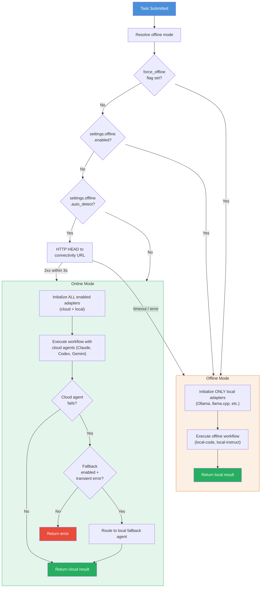
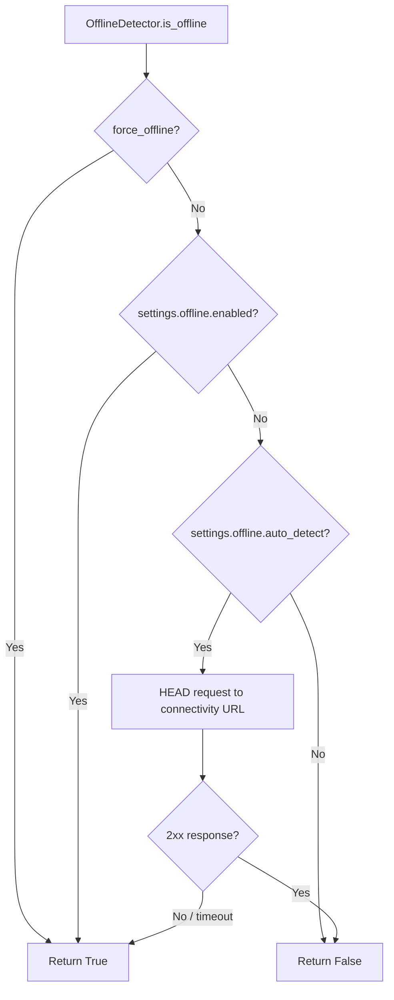

# Offline Mode Guide

Both the Orchestrator and Agentic Team support running entirely offline using local AI models via Ollama or llama.cpp-compatible servers.

## How Offline Mode Works

1. **Auto-detection**: The `OfflineDetector` pings a configurable URL (default: `https://httpbin.org/status/200`). Only 2xx responses count as online.
2. **Force offline**: Pass `force_offline=True` to bypass detection.
3. **Fallback routing**: When a cloud agent fails with a transient error (connection, timeout, 5xx), the `FallbackManager` routes to a configured local fallback.

### Online vs Offline Execution Paths

The following diagram shows how the system decides between online and offline execution, and how fallback routing bridges the two modes in hybrid workflows.



## Configuration

### Enable Offline Mode

```yaml
settings:
  offline:
    enabled: true          # Force offline mode
    auto_detect: true      # Auto-detect when internet is unavailable
```

### Configure Local Agents

```yaml
agents:
  local-code:
    type: ollama
    enabled: true
    model: "codellama:13b"
    endpoint: "http://localhost:11434"
    offline: true
    timeout: 3600

  local-instruct:
    type: ollama
    enabled: true
    model: "mistral:7b-instruct"
    endpoint: "http://localhost:11434"
    offline: true

  local-large:
    type: llamacpp
    enabled: true
    endpoint: "http://localhost:8080"
    max_tokens: 4096
    temperature: 0.7
    offline: true
```

### Configure Fallback Routing

```yaml
settings:
  fallback:
    enabled: true
    map:
      claude: local-instruct    # claude fails → use local-instruct
      codex: local-code         # codex fails → use local-code
      gemini: local-instruct    # gemini fails → use local-instruct
```

### Offline Workflows

```yaml
workflows:
  offline-default:
    - agent: local-code
      task: implement
    - agent: local-instruct
      task: review

  hybrid:
    steps:
      - agent: local-code
        task: implement
        fallback: local-instruct
      - agent: claude
        task: review
        fallback: local-instruct
```

## Environment Variables

| Variable | Default | Description |
|----------|---------|-------------|
| `CONNECTIVITY_CHECK_URL` | `https://httpbin.org/status/200` | URL for online detection |
| `FORCE_OFFLINE` | `false` | Force offline mode |

## Running with Ollama

```bash
# Install Ollama
curl -fsSL https://ollama.com/install.sh | sh

# Pull models
ollama pull codellama:13b
ollama pull mistral:7b-instruct

# Start server (default port 11434)
ollama serve

# Run orchestrator in offline mode
./ai-orchestrator --offline --workflow offline-default "Build a REST API"
```

## Running with llama.cpp

```bash
# Start llama.cpp server
./llama-server -m model.gguf --port 8080

# Or use LocalAI, text-generation-webui, or any OpenAI-compatible endpoint
```

## Fallback Behavior

When fallback is enabled, transient errors trigger automatic routing:

| Error Type | Triggers Fallback? |
|-----------|-------------------|
| `ConnectionError` | Yes |
| `TimeoutError` | Yes |
| HTTP 502/503/504 | Yes |
| HTTP 500 | Yes |
| `"connection"` in error | Yes |
| `"syntax error in code"` | No (not transient) |
| Agent returns `success=False` with non-network error | No |

## Offline Detection Flow


