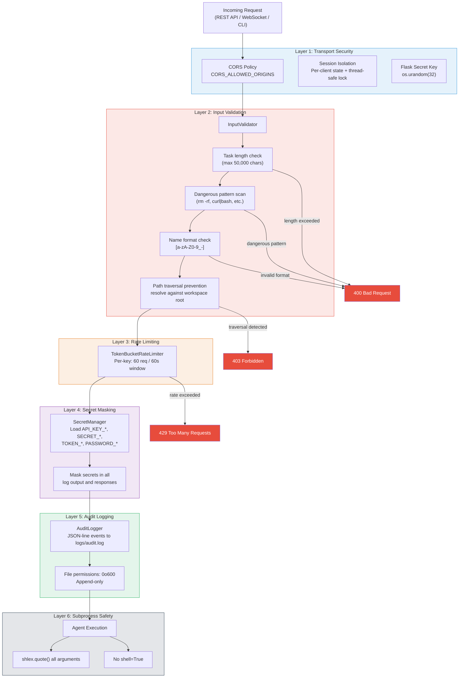

# Security Guide

Security architecture and hardening measures for both systems.

## Overview

Both the Orchestrator and Agentic Team implement defense-in-depth security:

| Layer | Implementation |
|-------|---------------|
| Input validation | `InputValidator` — length limits, dangerous pattern detection |
| Rate limiting | `TokenBucketRateLimiter` — configurable per-key rate limits |
| Secret management | `SecretManager` — env-based loading, masked logging |
| Audit logging | `AuditLogger` — append-only logs with 0600 permissions |
| Path traversal | `/api/files/` endpoint validates paths against workspace root |
| Session isolation | Per-client session state with thread-safe locking |
| CORS | Configurable via `CORS_ALLOWED_ORIGINS` environment variable |
| Secret keys | Generated with `os.urandom(32)` — never hardcoded |
| File permissions | Session files and audit logs created with `0o600` |
| Subprocess safety | `shlex.quote()` for shell arguments; no `shell=True` |

## Input Validation

The `InputValidator` class (in `orchestrator/security_module/security.py`) validates:

```python
from src.domain.models import InputValidator

# Task validation — checks length and dangerous patterns
task = InputValidator.validate_task("Build a REST API")

# Workflow name — alphanumeric + hyphens/underscores only
name = InputValidator.validate_workflow_name("my-workflow")

# File path — prevents traversal attacks
path = InputValidator.validate_file_path(
    "src/main.py",
    allowed_root=Path("./workspace"),
)
```

### Dangerous Patterns Blocked

- `rm -rf`
- `curl ... | bash`
- `wget ... | sh`
- `> /dev/` (device writes)
- `format C:` (Windows)
- `del /F` (Windows)

### Length Limits

| Field | Max Length |
|-------|-----------|
| Task description | 50,000 chars |
| Workflow name | 100 chars |
| Agent name | 50 chars |
| File path | 4,096 chars |
| Client ID | 128 chars |

## Rate Limiting

```python
from src.domain.models import TokenBucketRateLimiter

limiter = TokenBucketRateLimiter(rate=60, window=60)  # 60 req/min
limiter.check_limit("user_123")  # Raises RateLimitError if exceeded
```

## Environment Variables

| Variable | Purpose |
|----------|---------|
| `FLASK_SECRET_KEY` | Orchestrator Flask session key |
| `FLASK_SECRET_KEY_AGENTIC` | Agentic Team Flask session key |
| `CORS_ALLOWED_ORIGINS` | Comma-separated allowed origins |
| `FLASK_DEBUG` | Set to `true` only in development |

## Production Checklist

- [ ] Set `FLASK_SECRET_KEY` and `FLASK_SECRET_KEY_AGENTIC` to strong random values
- [ ] Set `CORS_ALLOWED_ORIGINS` to your specific domains
- [ ] Set `FLASK_DEBUG=false`
- [ ] Enable rate limiting in config
- [ ] Review audit logs regularly (`logs/audit.log`)
- [ ] Run with non-root user (Dockerfile uses UID 1000)
- [ ] Use TLS termination at load balancer/ingress level

## Defense-in-Depth Security Layers

The following diagram illustrates how every incoming request passes through multiple security layers before reaching the execution engine. Each layer independently validates and can reject the request.


