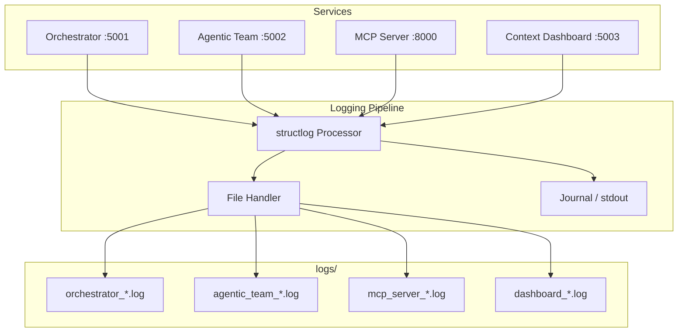

# 📋 Logs Directory

Runtime log output for all AI Coding Tools services. Contents are **git-ignored** — only this README and `.gitkeep` are tracked.

## Overview

Every service writes structured logs here during execution. Logs are the primary diagnostic tool for debugging agent behavior, tracking task progress, and auditing system activity.

## Services That Write Logs

| Service | Log Pattern | Port | Description |
|---------|-------------|------|-------------|
| **Orchestrator** | `orchestrator_*.log` | 5001 | Multi-agent task coordination |
| **Agentic Team** | `agentic_team_*.log` | 5002 | Role-based team collaboration |
| **MCP Server** | `mcp_server_*.log` | 8000 | Model Context Protocol tools |
| **Context Dashboard** | `dashboard_*.log` | 5003 | Graph visualization backend |

## Log Architecture



## Log Format

All services use **structlog** for structured JSON logging:

```json
{
  "timestamp": "2026-04-04T21:00:00.000Z",
  "level": "info",
  "event": "task_executed",
  "service": "orchestrator",
  "agent": "claude",
  "task_id": "abc-123",
  "duration_ms": 1450,
  "status": "success"
}
```

## Log Levels


| Level | Use |
|-------|-----|
| `DEBUG` | Agent prompts, adapter I/O, internal state |
| `INFO` | Task start/complete, agent selection, workflow steps |
| `WARNING` | Rate limits, fallback routing, retries |
| `ERROR` | Agent failures, timeout, connection errors |
| `CRITICAL` | Service crash, data corruption, security events |

## Configuration

Set log level via environment variable:

```bash
export LOG_LEVEL=INFO          # Default
export LOG_LEVEL=DEBUG         # Verbose (development)
```

In production (Docker/K8s/systemd), logs also go to **stdout/journal** for aggregation by Prometheus, Grafana Loki, or ELK.

## Retention

- **Development**: Logs accumulate until manually cleared
- **Production (Docker)**: Managed by Docker log driver (`json-file`, `max-size: 10m`, `max-file: 5`)
- **Production (K8s)**: Collected by node-level log agents (Fluentd/Fluent Bit)
- **Systemd**: Managed by `journald` (`journalctl -u ai-orchestrator`)

## Useful Commands

```bash
# Tail orchestrator logs
tail -f logs/orchestrator_*.log | python -m json.tool

# Search for errors across all logs
grep '"level":"error"' logs/*.log

# Count events by level
grep -oh '"level":"[a-z]*"' logs/*.log | sort | uniq -c | sort -rn
```
