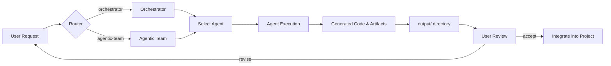
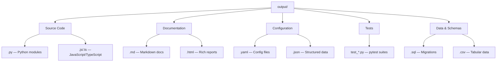

# Output Directory

Task execution results from AI coding agents managed by the Orchestrator and
Agentic Team systems. Every completed task writes its deliverables here so
they can be reviewed, tested, or fed into downstream workflows.

> [!IMPORTANT]
> **⚠️ Contents are git-ignored.** Only this README and `.gitkeep` are tracked.

## What Appears Here

| File Type | Description |
|-----------|-------------|
| `*.py` | Generated Python source files |
| `*.md` | Design documents, summaries, changelogs |
| `*.json` | Structured data, configs, API schemas |
| `*.html` | Reports, dashboards, documentation pages |
| `*.yaml` | Generated configuration files |
| `*.sql` | Database migration scripts |
| `*.txt` | Logs, plain-text notes |

## How Output Is Organized

Results are grouped by **session ID** or **task name**:

```
output/
├── session-a1b2c3d4/
│   ├── auth_module.py
│   ├── auth_tests.py
│   └── summary.md
├── rest-api-project/
│   ├── routes.py
│   ├── models.py
│   └── openapi.yaml
└── one-off-task.md
```

Small one-off tasks may produce a single file at the top level. Larger tasks
create a subdirectory containing all related artifacts.

## Execution Flow



## Output File Categories



## Lifecycle

1. **Task accepted** — the orchestrator or agentic team picks up a request.
2. **Agent works** — the assigned agent (Claude, Codex, Gemini, etc.) writes
   code and artifacts into `workspace/`.
3. **Results copied** — final deliverables are moved to `output/`.
4. **User reviews** — the developer inspects results and decides next steps.
5. **Cleanup** — old output is periodically pruned; nothing here is permanent.

## Inspecting Output

```bash
# List recent output
ls -lt output/

# View a specific task result
cat output/session-a1b2c3d4/summary.md

# Search across all output
grep -r "def authenticate" output/
```

## Notes

- This directory may contain **stale artifacts** from previous runs.
  Always check timestamps to confirm freshness.
- Output is **not** automatically integrated into the main project tree.
  Treat it as a staging area for generated code.
- To clear all output: `rm -rf output/* && touch output/.gitkeep`
